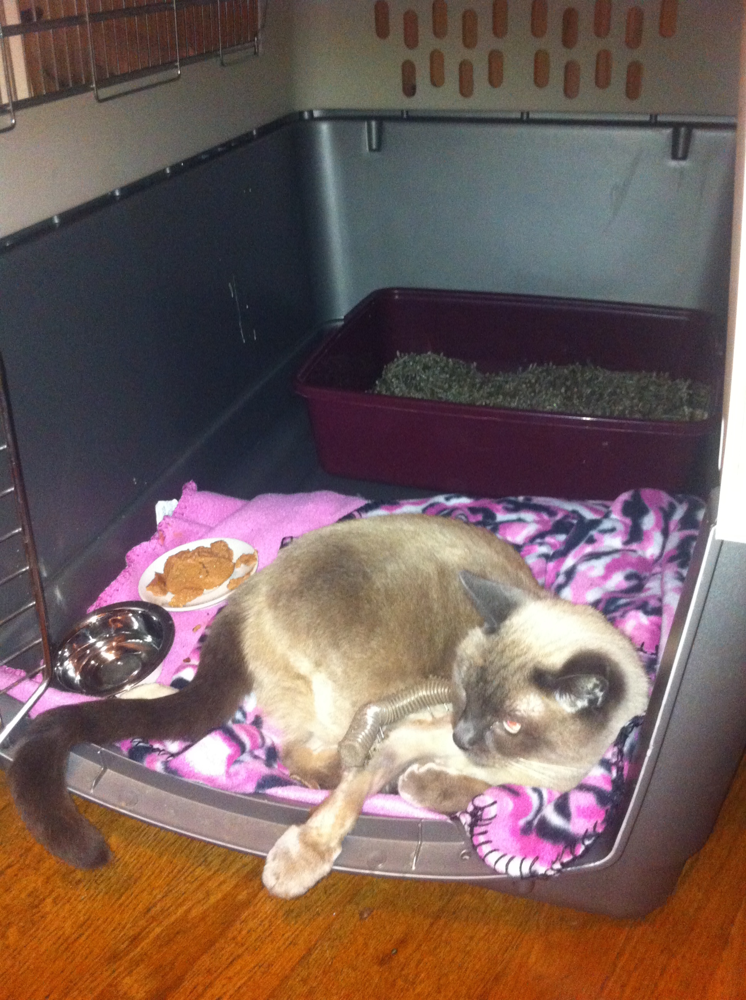

### Graphite-Rust

Xavier Lange

<xrlange@tureus.com>

<xavier.lange@viasat.com>

`@tureus`

---

# Me

  * Independent software contractor
  * Computer engineering background
  * Dig the outdoors
  * Cat owner

---

# My cat Lua

Inspiration to stop lounging and go for it.

---

Even if you might get hit by a car

---

Lua watching standup comedy

---

# Graphite-Rust

  * Experiment that took on a life of it's own
  * Built to satisfy some needs at ViaSat, Inc.
   * Love graphite
   * Hate it's opaque performance problems
   * Troublesome installation
  * Supports a OpenStack cloud installation and large-ish ELK cluster
  * http://viasat.github.io/everything-is-logging

---

# Let's Talk Metrics

---

# Not

 * Analytics
   * Urchin/Google Analytics
 * Business Intelligence
   * Hadoop/Storm
 * High-level
   * Web session heatmaps

---

## Graphite metric concepts

  (Name, Timestamp, Value)

---

#### Values

primitive like whoa

    (u32,f64)

---

Metric names are primitive

  proglangs.rust.community.active_members
  proglangs.rust.community.borrow_questions
  proglangs.go.community.active_members
  proglangs.go.community.segfault_questions

---

Finding your metrics can get fancy

  proglangs.*.community.active_members

Yields

  -> proglangs.rust.community.active_members
  -> proglangs.go.community.active_members

---

---

Handling lifetime issues is a normal task when writing Rust.

---

But fighting the compiler can be fun. Let's run through an issue

---

Graphite has great discoverability
Adding read_dir to see if a directory has anything inside it

    read_dir( path_buf ).unwrap().any(|f| {
        let metadata = f.unwrap().metadata().unwrap();
        metadata.is_dir() || metadata.is_file()
    })

But oh no! `read_dir( path_buf )` moved ownership of `path_buf`

What to do? `clone()` is easy. Just throw it in there.

    read_dir( path_buf.clone() ).unwrap().any(|f| {
        let metadata = f.unwrap().metadata().unwrap();
        metadata.is_dir() || metadata.is_file()
    })

Now the code compiles. But we just did a memory copy to generate a simple boolean flag. Let's take a closer look at the stdlib's definition of `read_dir`

    pub fn read_dir<P: AsRef<Path>>(path: P) -> Result<ReadDir>

Thas `AsRef` is interesting.

So it just has to "look" like a `Path`? If I recall correctly a `Path` is a slice of a `PathBuf`. And a slice means a `borrow`. The rust compiler was a little heavy handed in how it did the `AsRef`. How about we make it back up and just deal with a borrow? Make it a borrow.

    read_dir( &path_buf ).unwrap().any(|f| {
        let metadata = f.unwrap().metadata().unwrap();
        metadata.is_dir() || metadata.is_file()
    })

Boom! No clone(), no move. Just had to massage the compiler and make sure memory was happy.

----------
Popular libraries have bugs:

ERROR:iron::iron: Error handling:
Request {
    url: Url { scheme: "http", host: Domain("localhost"), port: 8080, path: ["metrics", "find"], username: None, password: None, query: Some("query=hey.there.*"), fragment: None }
    method: Extension("target=hey.there.*&from=-6h&until=now&format=json&maxDataPoints=1440GET")
    remote_addr: V4(127.0.0.1:56927)
    local_addr: V4(0.0.0.0:8080)
}

https://github.com/hyperium/hyper/issues/540

Stream parsing is hard. Things are rough out there.

Things That Have Bugged Me

----------
Semantics are tricky. Or is that explicit?

When you pass a value by reference you lose it mutability. It makes sense after you've worked with it for a while.

    let use_the_buf = {|&mut b : &mut Vec<u8>| b.push(b'a')};
    let mut buf : Vec<u8> = Vec::new();
    use_the_buf(&buf);

----------
Type-inference could be stronger

    let use_the_buf = {|&mut b : &mut Vec<u8>| b.push(b'a')};
    let mut buf : Vec<u8> = Vec::new();
    use_the_buf(&buf);

I would hope `use_the_buf` could infer the type based on the context.

----------
What did Rust let me do that Python couldn't?

Play detective

