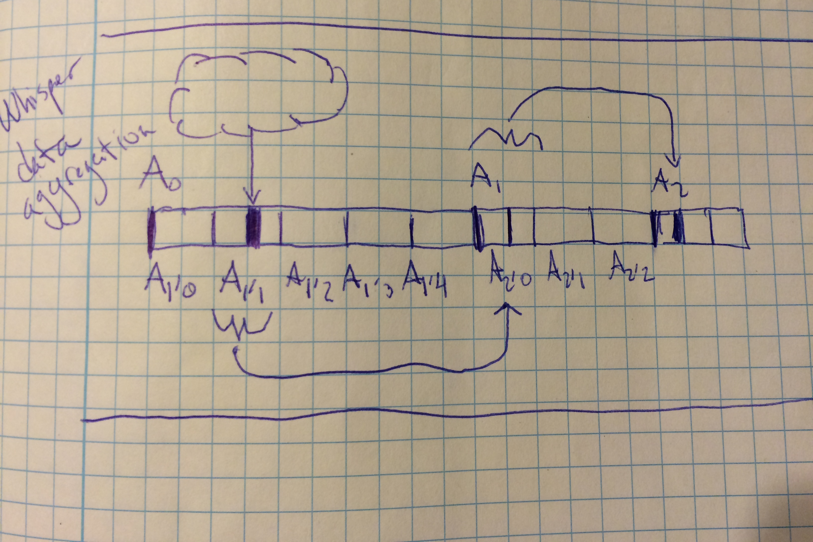

### Graphite-Rust

Xavier Lange

<xrlange@tureus.com>

<xavier.lange@viasat.com>

`@tureus`

---

# Me

  * Independent software contractor
  * Computer engineering background
    * Working with ViaSat, Inc. on large scale logging
  * Dig the outdoors
  * Cat owner

---

#### My favorite languages, in no particular order

  * OO

    * Ruby

  * Functional

    * Erlang
  
    * Haskell

  * Weird

    * Rust

---

---

# My cat Lua

Inspiration to stop lounging and go for it

---

Even if you might get hit by a car

---

Lua watching standup comedy

note: one example of things working out OK

---

# Graphite-Rust

  * Take a "slow" Python implementation and clone in Rust
  * Built to satisfy some needs at ViaSat, Inc.
   * Love graphite
   * Dislike it's opaque performance configuration
   * Troublesome installation
  * A dash of NIH
  * Supports a private cloud installation and large-ish logging/indexing cluster

Note: http://viasat.github.io/everything-is-logging

---

# Time series as a rust type

Pseudo code

<pre><code data-trim>
fn main() {
    let retention = 60*60*24; // one day
    let mut archive : Vec<(u32,f64)> = Vec::with_capacity(retention);

    let my_series = &mut archive[..];
    
    my_series[0] = (1438460243,100.0);
}
</code data-trim></pre>

note: I realized I should start by talking Rust. this code isn't quite right.

---

# We'll cover

 * Graphite concepts (run don't walk)
 * Analysis of graphite arch shortcomings (brisk walk)
 * The Rust-Graphite implementation (some examples, leisurely strole)
 * Analysis of graphite-rust shortcomings (leisurely strole)

---

# Let's Talk Metrics

---

# Not

 * Analytics
   * Urchin/Google Analytics
 * Business Intelligence
   * Hadoop/Storm
 * High-level
   * Web session heatmaps
 * Aggregation
   * StatsD

note: we're talking primitive metrics/time-series data

---

## Graphite metric concepts

 * Long-lived time series
   * Ex: Measure server A's CPU for 2 years
 * Regular update intervals
   * Metric is offered every X seconds (our happy-ish spot: 60s)
 * Pre-allocated space on disk
 * Basic metric naming
   * one-dimensional
   * ad-hoc

note: and sed/awk/nc. many shortcomings here. some ambitious databases out there working to address: metric names, distribution. but for me: simple wins

---

### Names

Metric names are primitive

<pre>
  proglangs.rust.community.active_members
  proglangs.rust.community.lifetime_questions
  proglangs.go.community.active_members
  proglangs.go.community.segfault_questions
</pre>

---

### Names

Finding your metrics can get fancy

<pre>
  proglangs.*.community.active_members
</pre>

Yields

<pre>
  -> proglangs.rust.community.active_members
  -> proglangs.go.community.active_members
</pre>

---

#### Values

primitive like whoa

    (u32,f64)

---

### Values

u32: seconds since epoch. SECONDS

f64: a number, big or small or in between

note: no units on the metrics. sometimes you get lost on what you're measuring.

---

### Values

but what can you possibly store with that?

...

enough to be dangerous!

note: Coda Hale's Metrics, Metrics, Everywhere

---

</img>

---

</img>

---

</img>

---

## Graphite in Python

Actually 3 core components, whose names I have adopted

  3. Graphite-Web
  2. Carbon
  1. Whisper

---

## Graphte in Python Installation

Tricky, many components

Run `sudo pip install` or learn the `virtualenv` toolchain

---

## 3. Graphite-Web

A multi-format web service written on top of Django.

 * Least interesting to me
 * Read-only access to database
 * HTML interface for rendering queries
 * REST-y interface
  * discovering metrics 
  * querying/transform and delivering
   * JSON, CSV, plaintext, pickle, etc
 * Tons of features, hidden gems

---

## 2. Carbon

A TCP/UDP daemon for recording datapoints

  * Moderately interesting to me
  * Creates metric storage if necessary
  * Writes metrics to disk
  * Handles the life-cycle of resources when writing

---

## 3. Whisper

  * Fascinating
  * Understands bytes on disk
  * Writes points
   * Through all archives
  * Should be easier than writing a ACID MVCC
    * Like, way easier
    * No real query planner
    * No multi-block joins
    * No transactions

note: should be simple enough, right? how hard can it be to write timestamps and points to disk?

---

### 3. Whisper

... Rust is fast. Maybe that'll make perf automaticly faster?

Turned out to be true

note: I'm not great at buffer management. I don't have a great story for reuse or how to carry them around.

---

## Digging in to Whisper

---

### Value propagation

</img>

---

### Invidual Archive

</img>

---

<pre><code data-trim>
pub trait WhisperFile {
    fn open(&amp;Path) -&gt; Result&lt;Self, Error&gt;;
    fn new(path: &amp;Path, schema: Schema) -&gt; Result&lt;Self, Error&gt;;
    fn write(&amp;mut self, current_time: u64, point: point::Point);
}
</code></pre>

<pre><code data-trim>
pub struct MutexWhisperFile {
    pub handle: Mutex&lt;File&gt;,
    pub header: Header
}
</code></pre>

note: I'm using some kind of cell to do a runtime mutable borrow

---

<pre><code data-trim>
// TODO: Don't think we need Copy/Clone.
// Just added it to make tests easier to write.
#[derive(PartialEq,Copy,Clone,Debug)]
pub struct ArchiveInfo {
    pub offset: SeekFrom,
    pub seconds_per_point: u64,
    pub points: u64,
    pub retention: u64,
}
</code></pre>

---

## Tuple Structs

Whisper constructs not present in Python

<pre><code data-trim>
// Index in to an archive, 0..points.len()
#[derive(Debug, PartialEq, PartialOrd)]
pub struct ArchiveIndex(pub u64);

// A normalized timestamp
pub struct BucketName(pub u64);
</code></pre>

note: expressive, zero-cost, safe

---

---

## Case Study: Wrap Around Read

Used in downsampling

  1. Example of "read" amplification
  1. I like "pure" code
  2. I was figuring out tangled python
  3. I wanted to reuse a buffer

---

## Case Study: Wrap Around Read For Downsampling

Type signatures are neat!

<pre><code data-trim>
pub fn read_ops<'a> (h_res_archive: &ArchiveInfo, 
                     l_res_archive: &ArchiveInfo,
                     h_res_points: &'a mut [point::Point],
                     point_timestamp: u64,
                     h_res_anchor: BucketName)
-> (
             (ArchiveIndex, &'a mut [point::Point]),
      Option<(ArchiveIndex, &'a mut [point::Point])>
   )
</code></pre>

Note: h_res 60s, l_res 1hr, need 60 h_res points. uses runtime checks. slightly weird code. experiment. prepares buffer for later read.

---

## Case Study: Wrap Around Read

Powered by a favorite: <code data-trim>split_at_mut</code>

<pre><code data-trim>
// Contiguous read. The easy one.
if h_res_start_index < h_res_end_index {
    ((h_res_start_index, &mut h_res_points[..]), None)
// Wrap-around read
} else {
    let split_index = (hres.points - start_index.0) as usize;
    let (first_buf, second_buf) = points.split_at_mut( split_index );
    let zero_index = ArchiveIndex(0);
    ((h_res_start_index, first_buf), Some((zero_index, second_buf)))
}
</code></pre>

---

## Is it faster?

  * Yes. Duh.

  * 2-3x faster.

  * Python: spends more time in userland

  * Rust: spends more time in syscalls

  * With almost the same naïve behavior as python

  * Poor buffer reuse

  * Open file, read headers, close it right away

note: complicated history here. we were recording too many metrics at too high of a frequency. but apples to apples is good.

---

## Is it easier to distribute?

Yes. Duh.

<pre><code data-trim>
$ du -hs target/release/{whisper,carbon,graphite}
1.1M  target/release/whisper
1.2M  target/release/carbon
2.0M  target/release/graphite
</code></pre>

note: this is the incomplete code I've been describing. but the staticly linked binaries are rad.

---

## Where do we stand in features today?

---

## Carbon

 Uses of the WhisperCache

  * Hold files descriptors for longer
  * Still need eviction
  * Make re-use fast
  * Does periodic fsync
  * Hides creation/reuse

note: fits very well with the lifetime of data. remove from cache will sync and close

---

## Carbon's Cache

<pre><code data-trim>
pub struct Cache {
    pub base_path: PathBuf,
    open_files: HashMap< PathBuf, Box< MutexWhisperFile > >
}
</code data-trim></pre>

---

## Graphite

Not very usable. Having issues with my libraries.

You can still use the Python implementation.

---

## Next steps

Keep improving write performance

  * mmap data, manual

  * get better at dtrace

  * carry buffers around

---

## Was rust a good choice?

I don't like to advocate rewrites. Especially since I didn't write the first impl.

Rust has great tooling, tests, benchmarks.

I can use mmap.

I can reuse buffers.

I have a compiler yell at me.

So I'm happy.

note: python implementation has a lot of great features, active maintainers. if you structure your whisper files properly and set your expectations you'll be in good shape.

---

## Anyway

Rendering a ton of metrics is my current bottleneck in JS land

Server side rendering to PNG could be interesting

---

## Thanks

twitter: @tureus

email: xrlange@gmail.com

graphite-rust: https://github.com/tureus/graphite-rust

---

Let's run through an issue adding the "metric drilldown has children?" feature

---

Use <code data-trim>read_dir</code> to see if a directory has anything inside it

<pre><code data-trim>
read_dir( path_buf ).unwrap().any(|f| {
    let metadata = f.unwrap().metadata().unwrap();
    metadata.is_dir() || metadata.is_file()
})
</code></pre>

---

But oh no!

<code data-trim>read_dir( path_buf )</code> moved ownership of <code data-trim>path_buf</code> and broke later code.

---

What to do? `clone()` is easy. Just throw it in there.

<pre><code data-trim>
read_dir( path_buf.clone() ).unwrap().any(|f| {
    let metadata = f.unwrap().metadata().unwrap();
    metadata.is_dir() || metadata.is_file()
})
</code></pre>

---

# JK

I try to avoid <code data-trim>clone()</code>. It's more fun that way.

---

Code compiles but requires a "wasteful" memory copy

A closer 👀

<pre><code data-trim>

pub fn read_dir&lt;P: AsRef&lt;Path&gt;&gt;(path: P) -> Result&lt;ReadDir&gt;

</code></pre>

---

What did Rust let me do that Python couldn't?

Play detective

